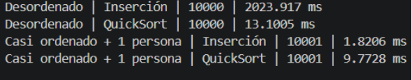
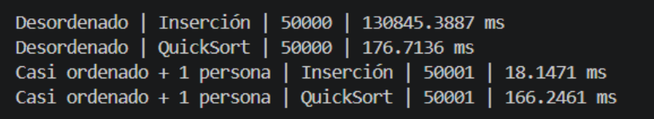
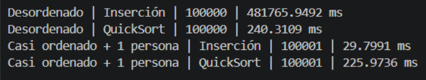
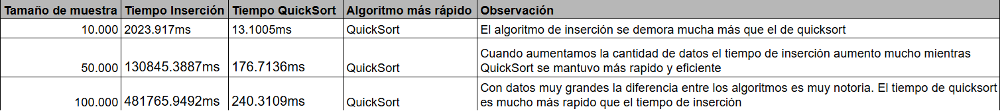
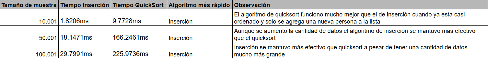
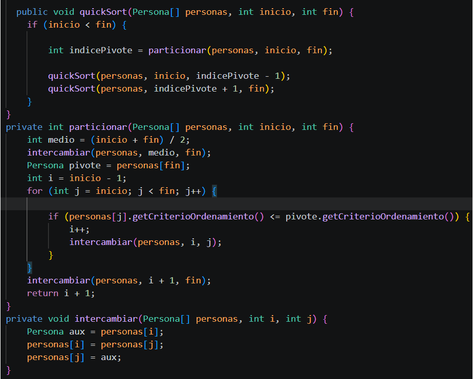
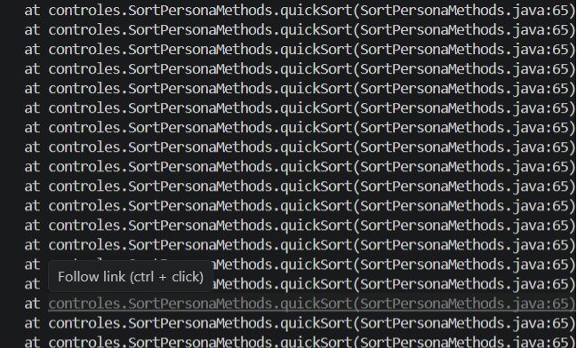

## Resultados Obtenidos

## Tabla 1: Arreglo completamente desordenado

## Tabla 2: Arreglo casi desordenado

### ¿Qué algoritmo fue más rápido en el escenario desordenado?
En el escenario desordenado el algoritmo más rápido fuel el de quicksort

### ¿Qué algoritmo fue más rápido en el escenario casi ordenado?
En el escenario donde esta casi ordenado el más rápido fue el algoritmo de inserción

### ¿El crecimiento del tamaño de muestra afectó por igual a los dos algoritmos?
El crecimiento del tamaño de muestra no afecto de la misma forma a los dos algoritmos. En el primer caso podemos ver como el metodo de inserción aumenta mucho más el tiempo mientras que en quicksort no aumenta de manera tan grande.

### ¿Por qué Inserción puede mejorar cuando el arreglo ya está casi ordenado?
Inserción es mejor cuando el arreglo esta casi ordenado porque ahora que ya esta más ordenado necesita hacer menos comparaciones e intercambios para que el arreglo este ordenado.
### ¿Por qué QuickSort suele ser mejor cuando los datos están muy desordenados?
QuickSort suele ser mejor cuando los datos están muy desordenados porque no tiene que comparar elemento con elemento como es en inserción que se compara por cada uno de los elementos. QuickSort divide el arreglo en partes más pequeñas y  utiliza un pivote. Luego ordena cada parte por eso es que es más eficiente cuando los datos están desordenados. 

## obervación

El error que se ve arriba pasa porque quicksort anterior siempre usa el último dato como pivote cuando el arreglo estaba casi ordenado.Al usar el final como el pivote podia ocurrir que el final sea mayor a todos los numeros. Entonces dejaba casi todos los elementos en un solo lado cuando se hacen la division. Por eso el método se repetía muchas veces y podía fallar. Pero si usamos el pivote con el valor del medio el arreglo se separa de mejor forma.Asi podemos  reducir las llamadas recursivas.

## Conclusiones

### Conclusión 1
 Cuando estaba completamente desordenado,  el algoritmo quicksort es mucho más rápido que Inserción. La diferencia en el tiempo entre los dos se observó cuando se usó un tamaño de 50.000 y de 100.000. Con estos tamaños e tiempo de inserción aumento mucho más comparado con el de quicksort
 
### Conclusión 2
Cuando el arreglo estaba casi ordenado y se agregó una persona más el algoritmo de inserción fue más rápido en todos los casos. Entonces la inserción es mejor cuando solo vamos a agregar datos.

### Conclusión 3

En general el tamaño de la entrada afecta mucho el tiempo necesario para ordenar cuando usamos el algoritmo de inserción. Con quicksort el tiempo no aumenta de manera tan drástica como aumenta con insercion.
